# InventorySystem
An inventory system with a GUI for a fictional company written in Java. This was for a class with the first program
I have written in Java. The requirements/scenario for the school project is found below.

---------------------------------------------------SCENARIO------------------------------------------------------------

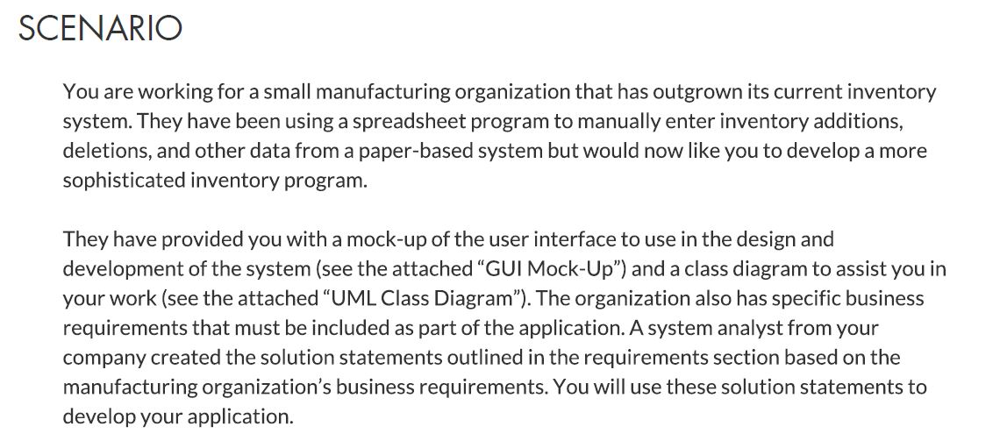

---------------------------------------------------REQUIREMENTS--------------------------------------------------------

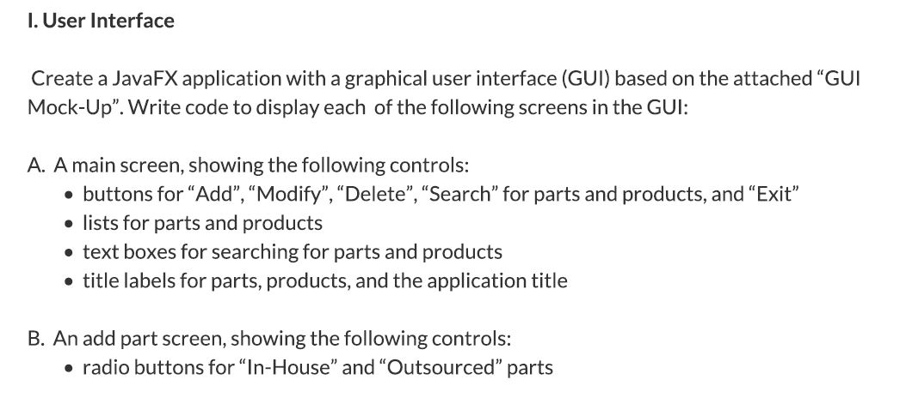

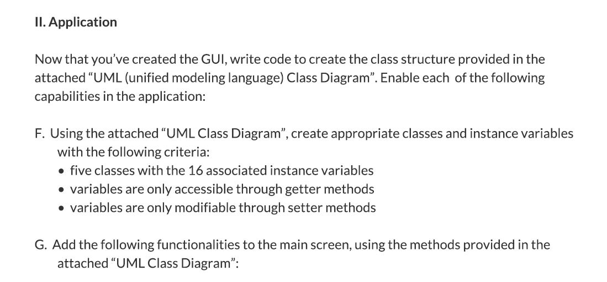
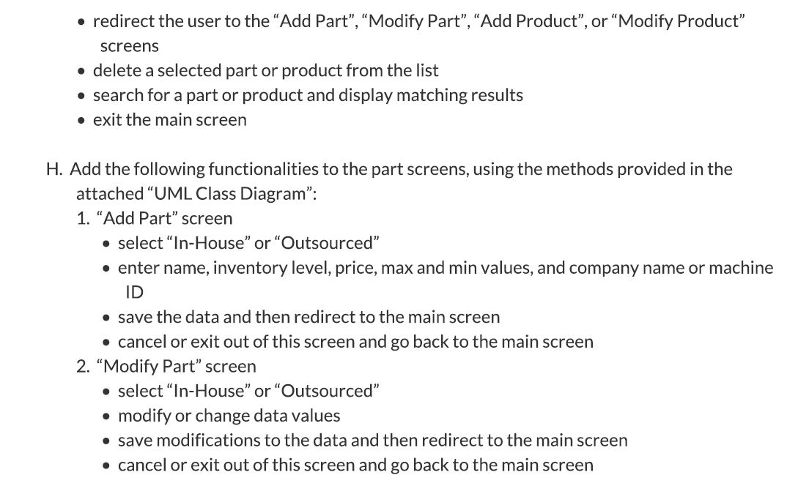
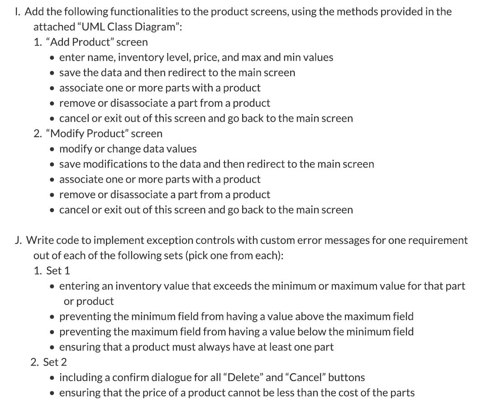
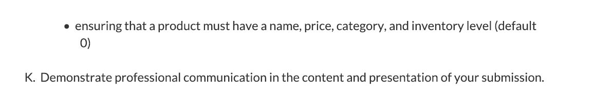

---------------------------------------------------CLASS-DIAGRAM-------------------------------------------------------

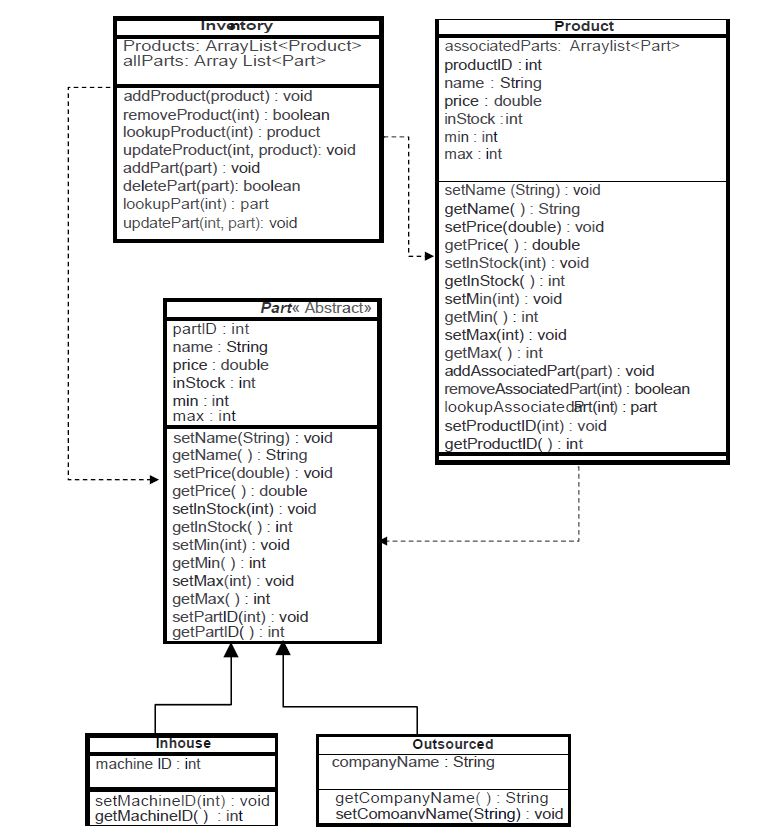

---------------------------------------------------RUNNING-PROGRAM-----------------------------------------------------

Home Screen

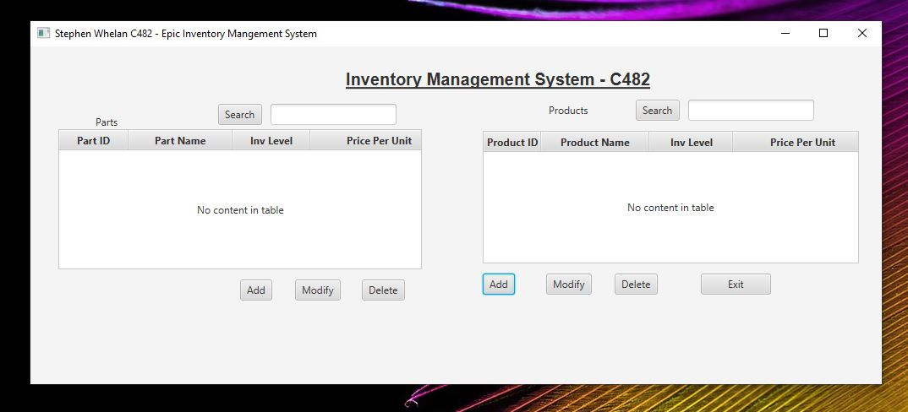

Add Part Screen

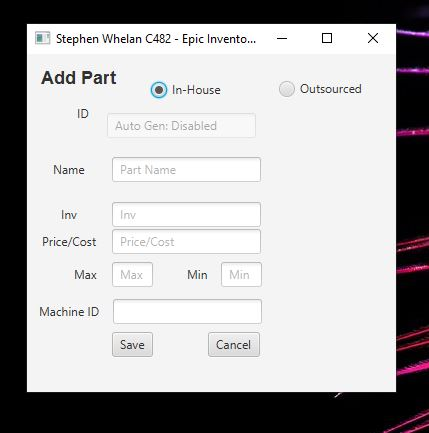

Add Product Screen

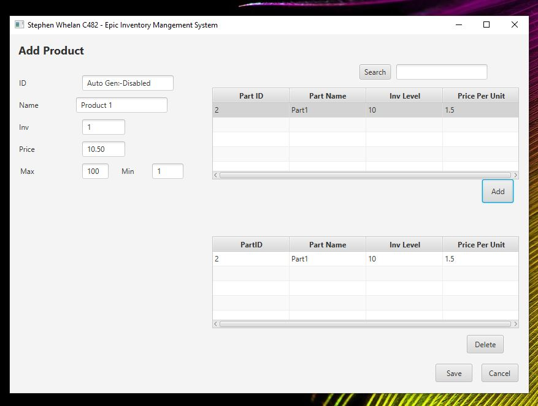

Modify Part Screen

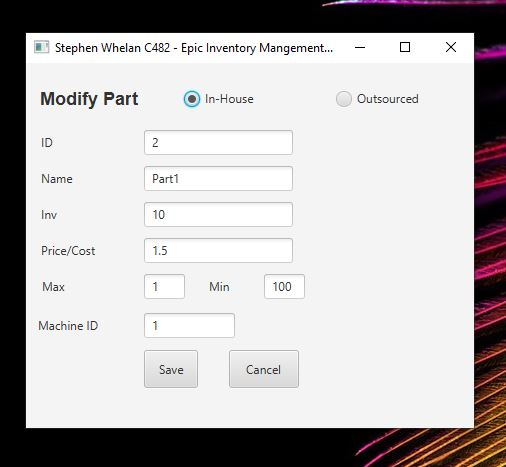

Modify Product Screen

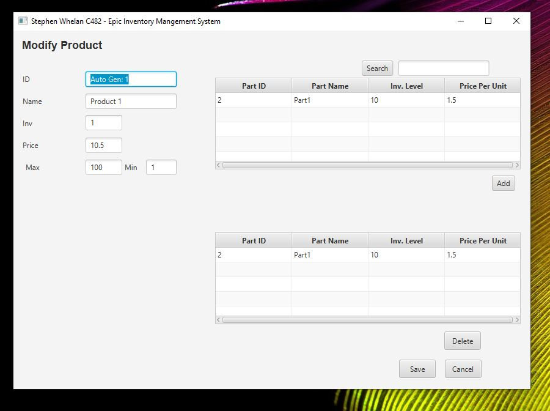
