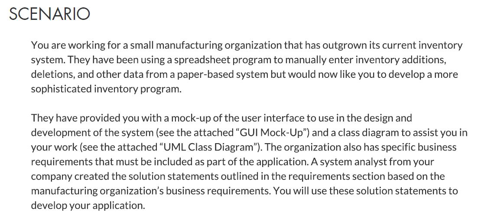
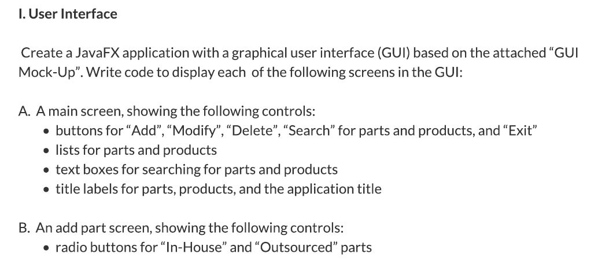
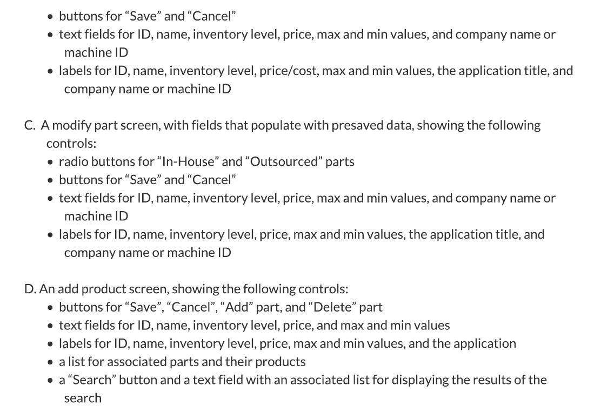
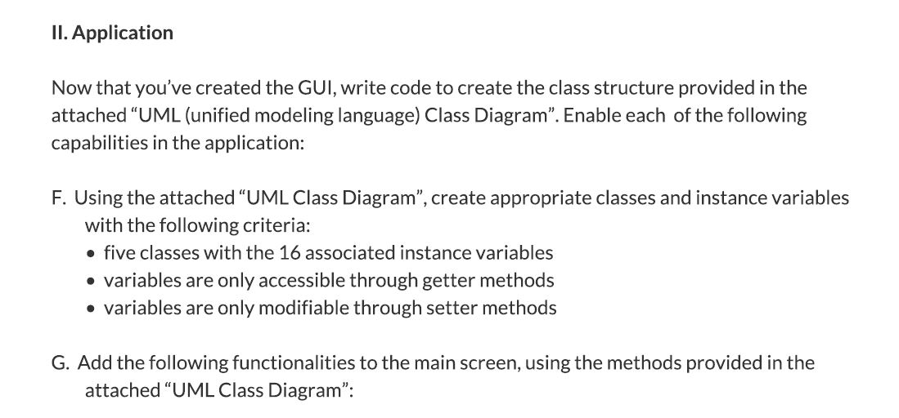
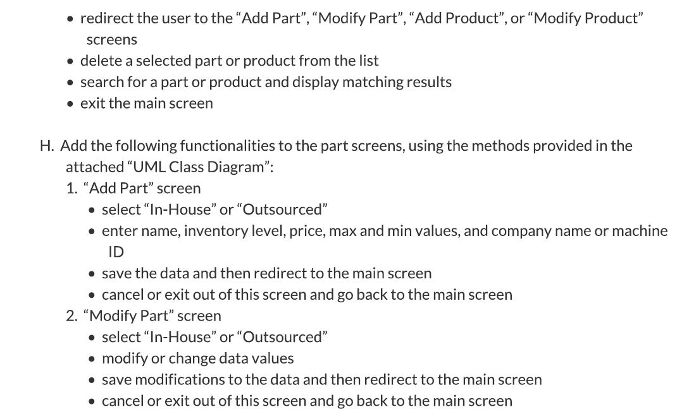
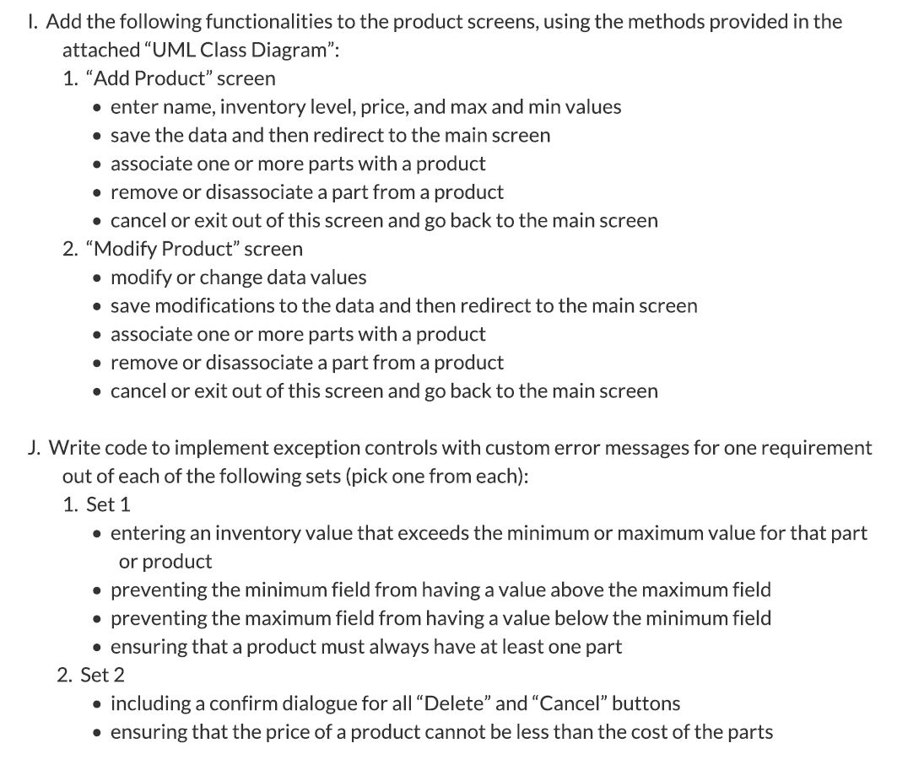
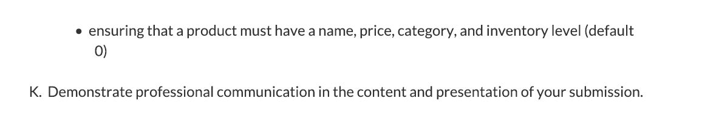
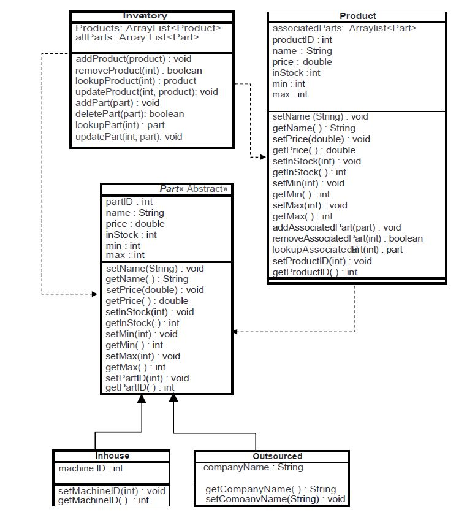

# InventorySystem
An inventory system with a GUI for a fictional company written in Java. This was for a class with the first program
I have written in Java. The requirements/scenario for the school project is found below.

---------------------------------------------------SCENARIO------------------------------------------------------------

---------------------------------------------------REQUIREMENTS------------------------------------------------------------

---------------------------------------------------CLASS-DIAGRAM------------------------------------------------------------

